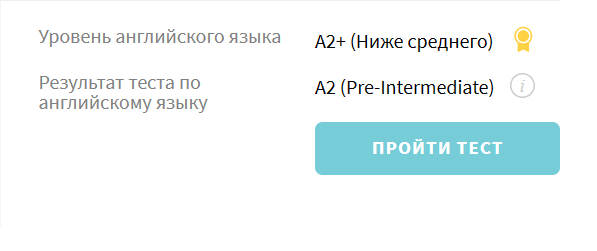

# __Vita Hil__
*****
## Junior Frontend Developer
*****
## Contacts:

### Mobile phone: +375 33 9078245
### Email: vitamopd@gmail.com
### Telegram: @vvetkaaaa
****
## About myself:

### My name is Vita and I am 18 years old. 
### I am a beginner frontend developer. Interest in the field of programming appeared a year ago, so I entered the university with a degree in information technology software. 

### After a year, I realized that most of the disciplines I highlight and are interested in computer markup languages. Therefore, having successfully closed the session, I want to take the course so as not to stand still, consolidate my knowledge and catch a lot of new information.

### Now I don’t have many skills, basic knowledge of figma, and so proactive in building multi-page sites. But I want to do something more serious, so let's go.
****
## Skills and Proficiency:
* HTML5, CSS3, C++, JavaScript 
* Git, Github
* VS Code, VS
* Adobe Photoshop, Figma
*****
## Code example:

```javascript
const menuBtn = document.querySelector('.menu-btn');
const menu = document.querySelector('.menu__list');

menuBtn.addEventListener('click', () =>{
  menu.classList.toggle('menu__list-active');
});
```
****
## Languages:
* English - A2
   * 
* Russian - Native
* Belarussian - Intermidiate